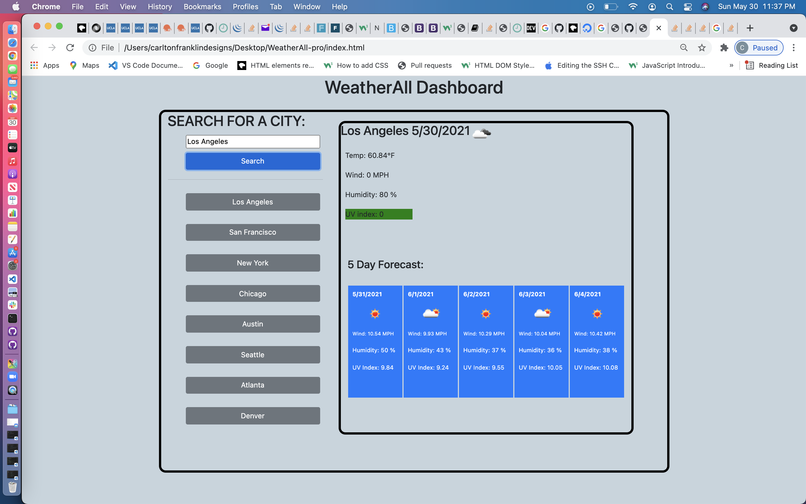

# WeatherAll-pro

## Description 

 
 An application designed to fetch the weather information of any city in the United States and return it to the user. 
 By inserting a city name and pushing search, the user is provided with not only weather details for the current day but also for the next 5 days. 
 A user of this application will benefit by being able to better prepare for the climate conditions of various locations 

 ### Snapshot

## Table of Contents

* [Installation](#installation)
* [Usage](#usage)
* [Credits](#credits)
* [License](#license)

## Installation

Technology: JQuery, BootStrap, MomentJS, OpenWeather API

## Usage 

Enter any city from the United States into the search box or select from the list of 'previously searched' cities to fetch current weather data as well as a five-day forcast for that particular city

## Credits

Thomas Walker 

## License

## Contributing

    

## Tests
 No tests were used to develop the application 
        

## Contact

 Thomasnwalker@yahoo.com ; github.com/twalker7

## Purpose 

## Website 
https://twalker7.github.io/WeatherAll-pro/

